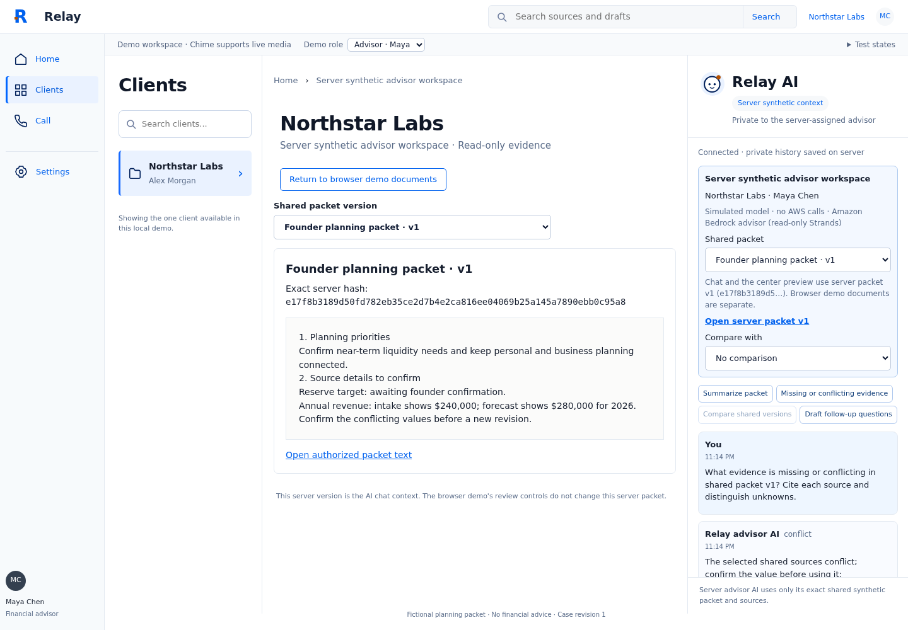
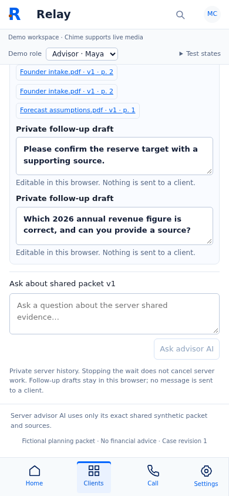

# Follow-up status: founder live gate resolved

The subsequent user-authorized Sol writer loop passed the unchanged founder Bedrock evaluator in40.31s. Final backend166passed, founder browser6passed. See [WRITER-RESULTS.md](WRITER-RESULTS.md). The original report below is retained as historical evidence; its incomplete status is superseded by this verified follow-up. All six original acceptance units are now satisfied within the documented synthetic/local scope and limitations.

---

# Advisor Bedrock loop results

Implemented on `codex/advisor-bedrock-loop` from fetched main `b2c7e27`, in `/home/tim/Relay-worktrees/advisor-bedrock-loop`. No commit, push, merge, deploy, package install, secret inspection, IAM change, or external message.

**Overall acceptance: incomplete. Advisor live acceptance passed; founder live PDF acceptance failed.** Stop rules reached: three of three synthetic smoke attempts consumed. Five application correction rounds used out of six; no scenario exceeded two corrections. Founder staging was not retried after its second WRITER_REQUIRED result. The last attempt continued independent advisor checks.

## Feature acceptance

| Fixed unit | Result | Evidence |
|---|---|---|
| 1. Server authorization, exact grants, private durable history | PASS | Cookie/CSRF, cross-case and browser isolation, source/packet hash binding, partial revocation and final-commit checks; backend tests and independent review |
| 2. Grounded read-only Strands advisor | PASS, bounded quote-based contract | Real AWS cited conflict/missing answer and two-version comparison; actual Strands adversarial/tool tests |
| 3. Clients UI, shortcuts, private editable drafts | PASS | Unit/browser tests and direct desktop/narrow computer use; exact server preview and history context |
| 4. Idempotency, interruption/errors, action boundaries | PASS | Exact request-key correlation, retry/reload, capacity/restart, timeout, tool/schema/budget failures; model has no action tools |
| 5. Documents regressions and founder PDF preservation/live acceptance | PARTIAL / live FAIL | Both original Documents assertions pass; all offline founder gates pass; live founder evaluator returned WRITER_REQUIRED twice |
| 6. Independent review and evidence handoff | PASS | Independent review found no remaining material boundary findings after corrections; evidence and recovery below |

Five of six fixed units accepted; every criterion did **not** pass.

## Final verification

| Check | Actual result | Evidence file |
|---|---|---|
| Backend `.venv/bin/python -m pytest -q` | 152 passed, 26.38s | advisor-evidence/backend-final.txt |
| Frontend unit suite | 92 passed in 22 files | advisor-evidence/frontend-final-stable.txt |
| Lint / TypeScript | PASS | advisor-evidence/lint-final.txt, typecheck-final.txt |
| Production build | PASS; existing large-chunk warning remains | advisor-evidence/build-final.txt |
| Original demo browser suite plus 3 advisor cases | 69 passed, 3.2m | advisor-evidence/demo-final.txt |
| Original founder workflow browser suite | 6 passed, 47.8s | advisor-evidence/workflow-final.txt |
| Real advisor HTTP/API/SQLite/Strands integration | 2 passed, 9.8s | advisor-evidence/integration-final.txt |
| Founder prompt affected regressions | 45 passed | advisor-evidence/founder-staging-regression.txt |
| Original tests/evaluator preservation and whitespace | git diff checks passed; existing backend tests, original browser assertions and Documents tests unchanged | current diff |
| Independent review | No unresolved material permission/retrieval/agent findings | reviewer evidence summarized below |

A final direct `pytest` executable invocation initially failed collection because the reused venv entrypoint did not place this worktree on Python's import path. Reran with the documented interpreter form `python -m pytest`; all 152 passed. This was a command/environment issue, not a code fix. Earlier broad browser failures were resolved without changing original assertions; final run used a stable tree.

The demo-only suite logged refused advisor connections when its separate backend was absent. Its tests passed and the UI labels unavailable/server errors rather than using a hidden fallback. The actual-server advisor integration asserted no page errors or failed advisor responses for valid flows. Direct final advisor console inspection returned no warnings/errors. Founder Home separately shows the existing generic backend at port 8000 as unavailable; that Postgres/S3 upload service was not started or claimed verified.

## Live AWS evidence and roles

Profile `relay-hackathon`, region `us-east-1`; STS identity WSParticipantRole/Participant. Both exact configured inference profiles were ACTIVE and model access checks were available/authorized. Explicit `--region us-east-1` remains in the Windows credential_process bridge. No credentials were printed or inspected.

| Role | Exact model | Use |
|---|---|---|
| Advisor orchestrator | us.anthropic.claude-sonnet-5 | Only active advisor role; read-only shared version/packet/source tools |
| Founder orchestrator / writer | us.anthropic.claude-sonnet-5 | Existing PDF team orchestration and validated staging |
| Founder extractor / reader / verifier | us.anthropic.claude-haiku-4-5-20251001-v1:0 | Existing extraction, source review and PDF verification |

- Attempt 1: live extractor passed six grounded fields; unchanged founder evaluator failed WRITER_REQUIRED before advisor calls. No founder PDF acceptance claimed.
- Attempt 2: live extractor passed; reader and writer were both invoked, 10 tool calls observed, but no valid PDF edit staged. Same unchanged evaluator failed WRITER_REQUIRED. Precise failed writer tool/result is not established; safe diagnostics identify delegation but not root cause. Stopped founder path.
- Attempt 3: advisor-only after founder path stop. **PASS**, 59.38s for both bounded requests. Conflict/missing request used 3 model turns and 5 successful tool calls: list_shared_versions, read_shared_packet, three read_shared_source calls. Answer cited $240,000 versus $280,000 and missing reserve evidence. Source URLs/quotes, persisted history and idempotent replay passed. Comparison used 4 turns and 7 successful tools, cited both authorized versions and v2's $260,000 while retaining unresolved source conflict. Exact traces/answers are in advisor-evidence/live-attempt-3.txt.

Attempt 3 was explicitly labeled ADVISOR_PASS, never a combined founder pass. Original `check_bedrock.py` remains unchanged. No further live calls are authorized by this loop.

## Requirement-to-test map

- Real answers, source-read-before-cite, quote/hash/page validation: backend/tests/test_advisor.py actual_strands/read_before_cite tests; advisor integration and live attempt 3.
- Missing/conflicting evidence and two-version comparison: two_source_conflict_and_two_version_comparison and semantic_conflict_draft_and_unknown_review_validation; browser shortcut/comparison flow; live attempt 3.
- Role/case/grant isolation and private history: cookie_isolation_exact_hash_revocation_and_unshared_version, partial_source_revocation_hides_history_replay_and_late_answer, exact_packet_hash_bound_to_source_url; independent browser integration.
- Injection, invalid tools/results, schemas, repair and budgets: injected_source_text_cannot_become_citation, unavailable_tool_and_invalid_read_are_terminal, unregistered_tool_is_rejected_after_real_strands_attempt, malformed_tool_result_schema_is_rejected, json_fence_and_one_bounded_schema_repair_with_real_strands, model_turn_and_tool_call_limits, deadline_prevents_later_tool_and_context_reads.
- Durable history, retries, capacity, stop/reconnect and exact request matching: failed_request_retries_same_key_without_duplicate_messages, conversation_and_global_capacity_survive_restart; frontend-shared/src/advisorChat.test.tsx and advisorApi.test.ts; browser reload/private-draft tests.
- Human action gates and original Documents fixes: unchanged backend PDF/action tests, original six founder workflow browsers, unchanged Documents unit assertions and original demo review/attachment/call tests. No advisor tool can send, approve, share, save a packet or submit.

## Independent review and direct UI evidence

Independent reviewer inspected final authorization, retrieval, result validation and founder prompt changes. Review corrections addressed partial source revocation, post-timeout work, bounded prior history, legacy unscoped advisor catalog calls, and cross-tab pending-request correlation. Reviewer reran advisor tests and independently probed capacity: two simultaneous conversations accepted, third 429, same conversation 409, replay without another model call. No unresolved material boundary findings remained. Coordinator verified integrated suites above.

Direct computer use exercised advisor conflict/missing shortcut, source citation popup, private draft editing, comparison, reload and narrow 390px layout. Final clean-tab advisor response and console were inspected after integration. Founder source links and source preview were exercised at desktop and 390px; document scrollWidth matched viewport width. Temporary viewport overrides were reset.

Automated actual-server screenshots (simulated model, actual Strands/API):

## Changed files and design decisions

- backend/app/advisor/{store,model,api}.py and workflow_app.py: separate loopback synthetic identity/grants, SQLite history/idempotency, read-only Strands provider, authorized previews and guarded APIs.
- frontend-shared/src/advisorApi.ts, advisorChat.tsx, advisorChat.css, index.ts: server chat, bootstrap, request correlation, compact shortcuts, source links, retry/stop state and durable private drafts.
- advsior-frontend/src/{clients,documents,home}/Screen.tsx and Clients CSS: exact server packet view and chat; original Documents search/source regressions fixed; unscoped generic advisor catalog calls removed.
- client-frontend/src/home/Screen.tsx and styles.css: narrow restoration of browser-local source links and explicit attachment confirmation/cancel controls alongside existing backend upload UI.
- backend/app/workflow/team.py: clarified mandatory writer reads and exact proposal shape, plus safe failure diagnostics. Runtime gates, budgets and original evaluator unchanged. This did not resolve the live founder failure.
- New advisor backend/unit/browser/integration tests, isolated Vite/Playwright configs, bounded preflight/live harness scripts, setup docs, LOOP.md, append-only log and this report. Original LOOP retained in advisor-evidence/prior-LOOP.md.

## Limits and remaining uncertainty

This is synthetic local authorization, not production identity or RDS integration. New browser sessions have distinct server actors; two exact versions are granted and later versions are not automatically shared. Production multi-client onboarding and real founder uploads are not connected to advisor chat.

Answers deliberately use model-selected exact evidence quotes and validated labels with source-supported follow-up templates. Broad free-form synthesis and arbitrary inferred advice are not implemented. The conflict rules cover the synthetic revenue/reserve case; this is not a general financial reasoning validator. Preview endpoints return authorized text, not native PDF rendering.

Browser demo mode retains explicitly labeled simulated conversation/review controls; users explicitly enter the separate server synthetic workspace for real advisor chat. Private follow-up edits remain in that browser. External delivery is not implemented. The preview left running uses a clearly labeled simulated model and cannot incur AWS charges. Live advisor was verified via the actual API harness; browser integration uses deterministic Strands models. Physical touch, live media/Chime, production deployment and generic Postgres/S3 service were not tested.

Advisor limits: 2 concurrent jobs, 1 per conversation, 4 model turns, 8 tools, up to 4096 output tokens per turn, 60 seconds, at most 1 schema repair within the same limits. Timed-out work retains its capacity slot until completion and subsequent calls are blocked by deadline. Stop waiting does not claim server cancellation.

Five correction rounds: boundary review; browser compatibility/drafts; exact request correlation; founder staging prompt; founder local attachment confirmation. Routine harness routing and formatting cleanup were not application correction rounds. Account-wide usage observed 47% to 54% in the same window: 7 percentage-point change, not attributable task cost. No reliable per-agent/task cost claim. Five accepted units out of six attempted; founder live gate unresolved.

## Recovery steps

1. Continue in `/home/tim/Relay-worktrees/advisor-bedrock-loop`. Inspect `backend/app/workflow/team.py` consult_writer and `backend/app/workflow/tools.py` propose_pdf_edit. Add safe capture of structured writer tool errors (no hidden reasoning/credentials), then reproduce invalid/no-stage output offline with actual Strands. Do not weaken WRITER_REQUIRED, source reads, PDF verification or original evaluator.
2. After a diagnosed fix, run `cd backend && .venv/bin/python -m pytest -q`, then the unchanged founder workflow browser suite using `./node_modules/.bin/playwright test --config advisor.workflow.playwright.config.ts` from the worktree root. Review the fix independently.
3. A further billable smoke requires a **new explicit allowance**; all 3 attempts are consumed. Once authorized, run from backend: `.venv/bin/python scripts/run_advisor_check.py check --config /home/tim/Relay/backend/.relay/bedrock.json`. This invokes the unchanged founder evaluator and both advisor checks. Success must include preview, explicit confirmation and byte-identical download gates.
4. Login is currently valid. Only if it expires, run in Windows: `aws login --profile relay-hackathon --region us-east-1`. Do not change IAM as a workaround.

Setup commands for local preview and live configured serving are in docs/advisor-bedrock.md. Starting a live server can enable billable requests and does not renew this exhausted smoke allowance.
