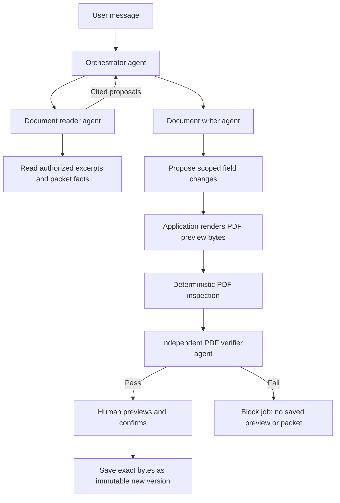

# Relay multi-agent document workflow

The backend packet workspace now uses a Strands **agents-as-tools** hierarchy.
There is one visible Relay conversation. Specialists have independent prompts,
agent instances and tool allowlists; they use the configured Bedrock model/profile.
They are role-specialized agents, not separately trained models.

The orchestrator delegates reading and writing through registered specialist tools.
The application mandates the verifier checkpoint after rendering, so the
orchestrator cannot skip it or approve its own work. Parsing and PDF rendering
remain deterministic application functions used by the agents' workflow.

| Role | Allowed work | Boundary |
| --- | --- | --- |
| Orchestrator | Calls reader/writer and returns the single Relay reply | Cannot directly edit, save, share or approve |
| Reader | Lists and reads case documents/packets; produces cited facts or clarification | No edit tool; citations checked against authorized source text |
| Writer | Reads evidence and proposes changes grounded in the reader output | No final save or arbitrary file access |
| Verifier | Reviews independent inspection of the actual generated PDF | No tools or mutations; must return the exact PDF hash and a clean verdict |

PDF inspection parses the actual bytes, compares labelled packet values or form
fields, checks rendered field appearances, and bounds file/page/text sizes. The
agent verifier adds a separate semantic review. Neither proves arbitrary visual
layout quality; the UI still requires human preview and confirmation.

The saved preview includes a verification report bound to its SHA-256 hash.
Older previews without a verification report can only be dismissed and reproposed.
The manual draft endpoint also runs PDF verification; its explicit create action
follows human confirmation of every field and preserves that existing workflow. Save
requires the same case revision and preview hash. Previous versions, conflicting
facts and manually confirmed newer values retain the existing protections.

## Runtime limits

Agents are created fresh per request with immutable case context. No cross-case
agent memory, shell/web tools, automatic tool discovery, or hidden SDK retries.
Reader and writer can each be delegated to once. Each gets up to four model turns;
the orchestrator gets four, and verification gets one: at most 13 model turns for
an edit job. Plan tool execution has a shared 18-call ceiling, plus each scoped
toolset's eight-call ceiling. Exceeding either ceiling remains a terminal failure even when the SDK converts a tool exception into a model-visible result. Planning times out after 90 seconds; verification
after 35 seconds. Timed-out work cannot persist a late result.

This replaces the earlier single-agent four-call budget to accommodate actual
specialist handoffs. Calls remain bounded; there is no autonomous swarm or
unbounded agent-to-agent loop. No automatic revision loop follows a failed PDF
verification. The user can correct inputs and submit a new request.

## Files and operation

- `backend/app/workflow/team.py`: orchestrator, specialists and bounded Bedrock execution.
- `backend/app/workflow/pdf_verification.py`: independent actual-byte verification.
- `backend/app/workflow/actions.py`: verifies before atomic preview staging and confirmation.
- `backend/app/workflow/service.py`: persisted task progression and job outcomes.
- `backend/app/workflow_app.py`: selects MultiAgentProvider when a model is configured.
- `client-frontend/src/workflow/`: shows one conversation and PDF check status.

The legacy founder AI Chat agent is a separate Strands workflow in
`backend/app/agents/`. It has six case-scoped checklist, activity and document
tools; it does not use this PDF specialist hierarchy or production actor
authorization. This team is used only by the isolated backend packet workspace.
Existing setup instructions in `bedrock-workflow.md` still apply. No new packages required.
Live AWS invocation, model quality and production storage/identity remain unverified.

Pattern reference: [Strands agents as tools](https://strandsagents.com/docs/user-guide/sdk/multi-agent/agents-as-tools/).
